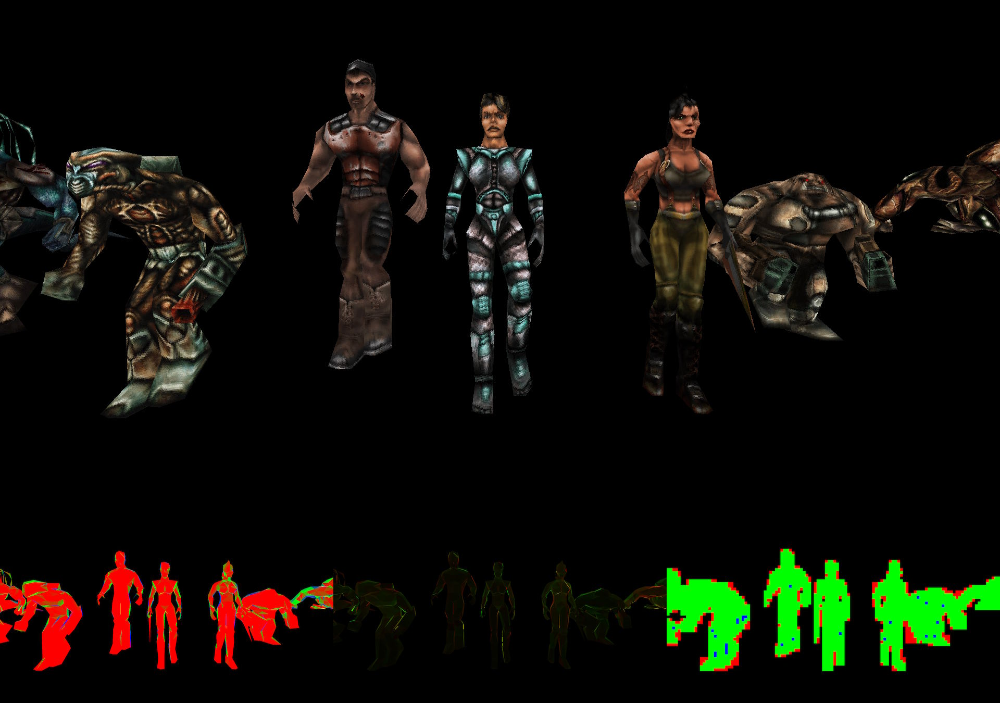
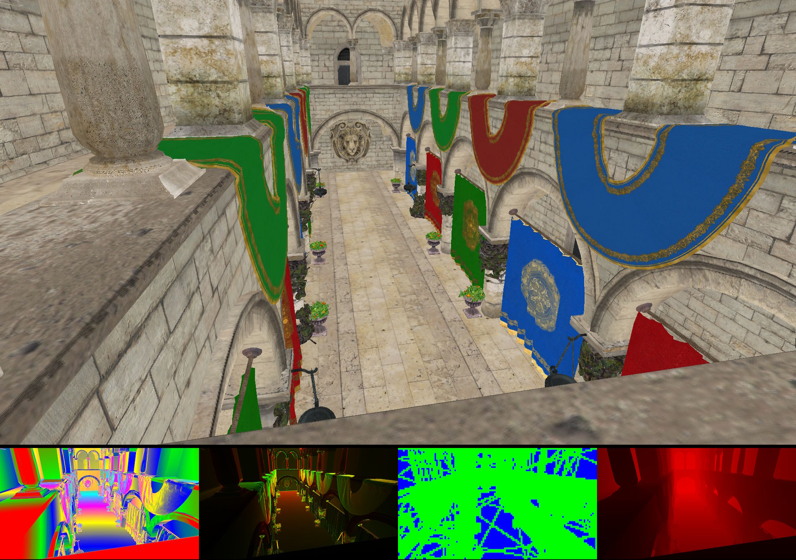

# Software Rasterizer

A **software rasterizer** implementing some rasterization techniques.
Designed to explore low-level rendering pipelines, CPU rasterization, and tiled framebuffer layouts...

---

## Features

- **Half-Space Rasterizer** – Efficient triangle coverage computation using half-space functions.
- **Tile-Based Rasterizer** – Divides the framebuffer into tiles for cache-friendly and parallelizable rendering.
- **Triangle Binning** – Prepares triangles per tile as a prerequisite for efficient tile-based rasterization.
- **Multithreaded Rendering** – Utilizes multiple CPU cores for parallel processing across the pipeline.
- **Frustum Clipping** – Efficiently culls geometry outside the camera view.
- **Depth Testing** – Correctly handles occlusion between triangles.
- **Unreal Engine-Style Texture Filtering** – Somewhat cheap replacement for bilinear filtering.
- **Mip-Mapping** – Level-of-detail texture support to reduce aliasing and minimize cache trashing.
- **Tiled Framebuffer Layout** – Optimized memory access pattern for performance.
- **Debug Overlays & Render Stats** – Visualize performance metrics and rendering pipeline stages.
- **2D Rasterization** – Supports rendering of 2D primitives and UI elements.
---

## Screenshots

  
  

